# Ingenious Impala


An analytics and data engineering experiment using data from AESO (Alberta Electric System Operator). This project requires access to a Databricks worskpace with Unity Catalog enabled. In this project we will be downloading and segmenting data to simulate incremental batch ingestion of data (the most common use case). Data will be incrementally ingested using a Lakeflow Pipeline and run through an ETL pipeline for downstream analytics and featurization.

## 1. Environment Setup
1. Clone this repository into a git folder in Databricks <br/>
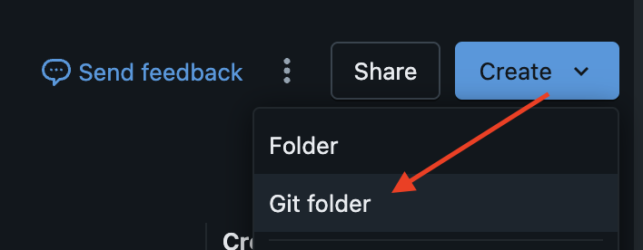<br/><br/>
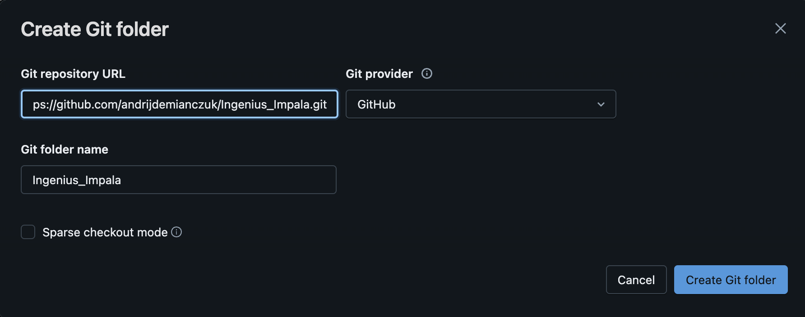<br/>
1. By default, the project uses the `main` catalog. If you want to use a different catalog create a catalog making note of the name (e.g., `development`)
1. A database with a unique user name will be created in the data prep notebook. This can be overridden if prefer a custom catalog name.
1. For this lab, if you want to use different catalog and database names they will need to be updated in each notebook and python module.
1. Open the folder `1_data_prep`. In here, there are two notebooks. The first notebook (`01_data_prep`) only needs to be run once to create the originating data source, database and data volume.
1. Open `01_data_prep` and modify the variables declared in the first cell. These variables set the catalog name, database and storage volume labels.
1. Run the contents of `01_data_prep`. It is recommended to run this notebook in sequence for optimal compatability.
1. `01_data_prep` is a notebook that takes in a csv file of our data and chunks it up into a series of smaller csvs and parquet files that we can use to update incrementally. This is a realistic simluation of data coming in and landing in a storage directory that the pipeline in this workshop will use to ingest, integrate and process.
    1. `01_data_prep` creates the entire structure for the csv loader. You need a storage volume for this to work properly. We're calling ours `data` and it's under the `development.{your_unique_database}` database
    1. `02_ingest_file` is a script that we'll run to incrementally load one csv file after the other. This script copies data from the csv volume directory to the loaded volume directory to simulate files 'landing' in some type of cloud storag object.
    1. `02_ingest_file` has one cell at the bottom that's commented out. This commented out cell resets the testing environment clearing out the loaded files and drops the pipeline tables. To re-run the pipeline from scratch, it needs to be either deleted and re-importanted or fully refreshed. To do that, simply uncomment the lines in the cell and replace the name of the catalog and database with your own:
    ```python
    #TODO: Replace the following variables with your catalog and database name
    catalog = "YOUR_CATALOG_NAME"
    database = "YOUR_DATABASE_NAME"

    #Create the variables for our storage locations
    table = f"{catalog}.{database}.csv_copy_progress"

    spark.sql(f"""
      DROP TABLE IF EXISTS {table};
    """)

    dbutils.fs.rm(dst_dir, True)
    ```

### Project Structure
* `1_Data_Prep` contains in-line documentation of what's going on within the two notebooks.
* `2_Ingestion` is a directory that's mapped directly to a Databricks Lakeflow Pipeline. This directory contains the common structure for a pipeline. Within this directory there are a few directories to make note of:
  * `disabled` is a directory where we will be storing files that are excluded from a pipeline run. Think of it as a 'staging' area.
  * `documentation` contains the documentation and walkthrough of the actual Lakeflow Pipeline. Look here for documentation to work through the Lakeflow Pipeline demo
  * `explorations` are a collection of functions (SQL format) that explore what we want to do with our data. This is for exploration only and gives us an idea of what we want to put in our final pipeline.
  * `transformations` are the meat-and-potatoes of our pipeline. All code files in this location are read in first by Lakeflow and a DAG is built to understand what transformations are done, and in what order. This is important because we can insure that lineage and governance are preserved.


## 2. Project Confirmation
1. Make sure you go through the above setup process first. This ensures that the data is present and available for processing in a volume. **In order for the pipeline to work, `02_ingest_file` has to be run at least once, otherwise the pipeline will return an error.**
1. When you run notebook `02_ingest_file`, the first cell creates a unique user id. **MAKE NOTE OF THIS USER ID - WE WILL NEED IT LATER** <br/><br/>
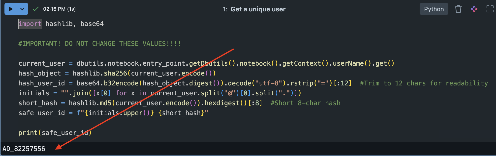
1. Make sure the following has been completed:
    * A catalog was created (e.g., "development")
    * A database (schema) was created (e.g., "your_unique_database")
    * A storage volume called "data" was created in your database
    * The `00_data_prep` notebook was successfully run
    * Your storage volume ("data") looks similar to this:<br/>
    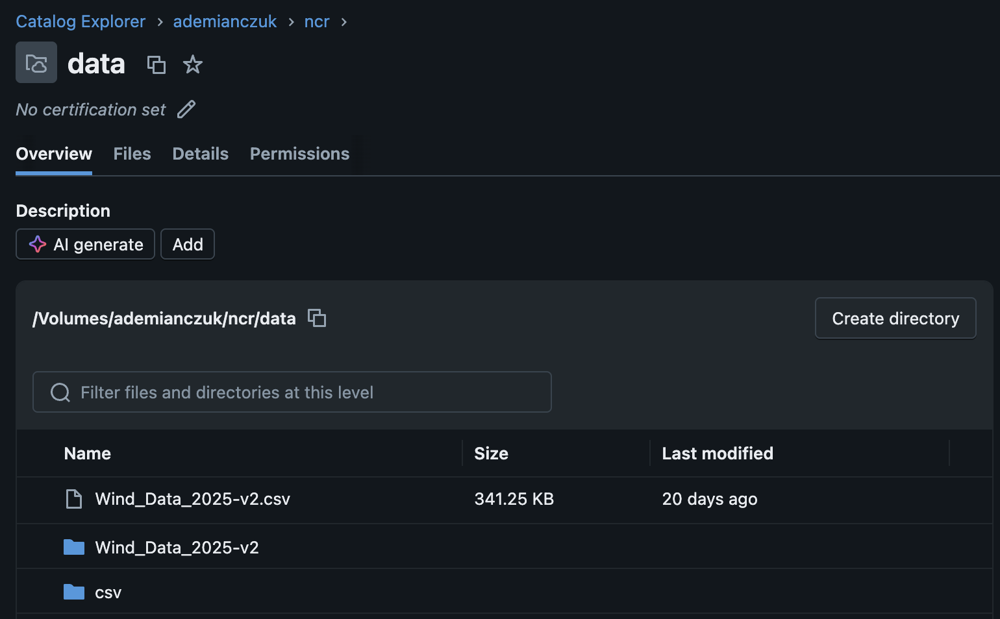<br/>

## 3. Pipeline Configuration
Next, we need to set up our pipeline and get things going. We're going to be using the new Databricks Lakeflow Pipeline Editor for this.
1. Turn on (or make sure it's enabled) the new Databricks Lakeflow Pipeline Editor.
    1. In the top right of the screen, you should see a small logo with one of your login initials. You'll need access to the 'previews' feature. <br/><br/>
    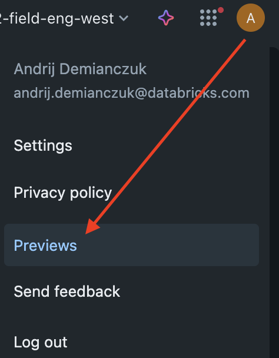<br/><br/>
    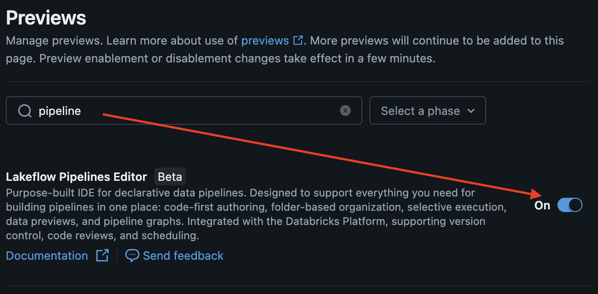<br/><br/>
**NOTE:** Depending on when you are running this project, the new pipeline editor might already be generally available. If that's the case, then this step is un-necessary and should be enabled by default.
    1. (Optional) You can also check the user settings to see if the new editor is already enabled: <br/><br/>
    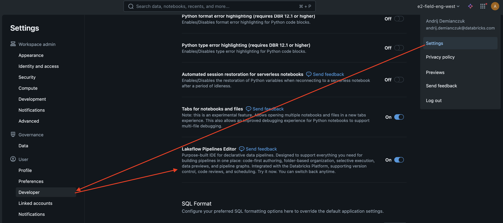
1. In the `Jobs & Pipelines` menu, create a new `ETL Pipeline` <br/><br/>
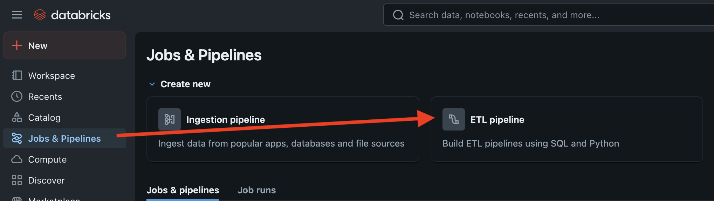
1. We're going to give the pipeline a unique name to make it easy to identify<br/><br/>
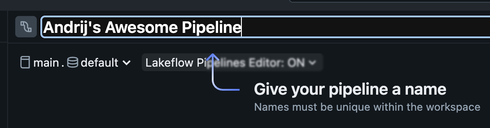
1. Since we imported the code source from github, we'll be adding existing resources to the pipeline <br/><br/>
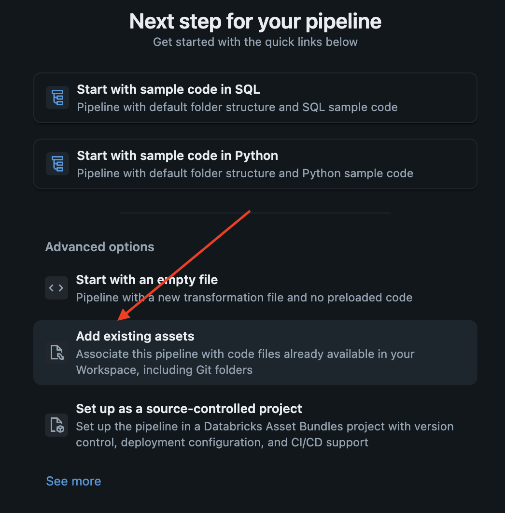
1. In the add assets dialog, you need to configure the pipeline root (`Ingenious_Impala/2_Ingestion`) and the transformation code path (`Ingenious_Impala/2_Ingestion/transformations`)<br/><br/>
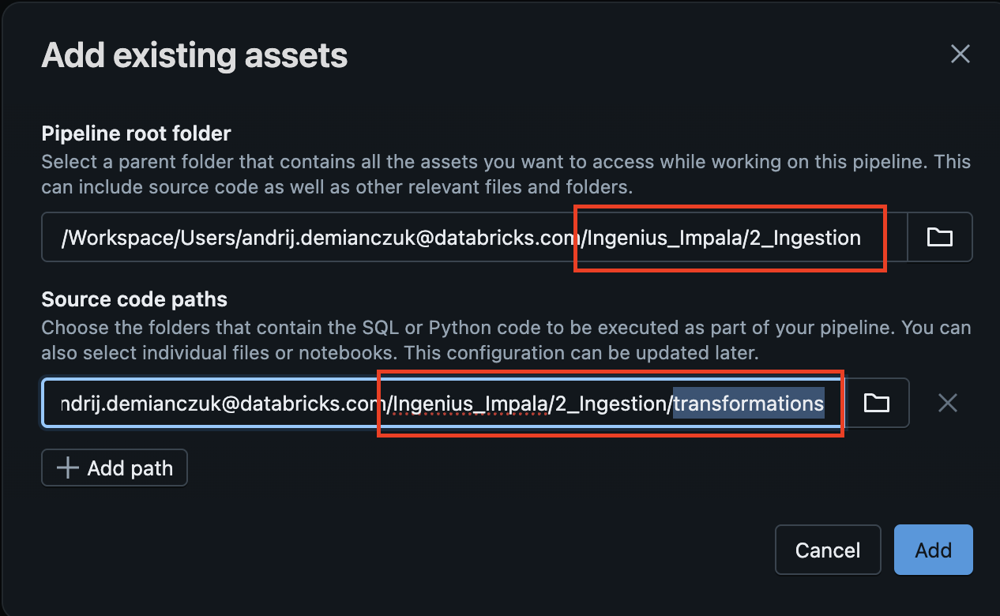
1. Your pipeline structure should look as follows<br/><br/>
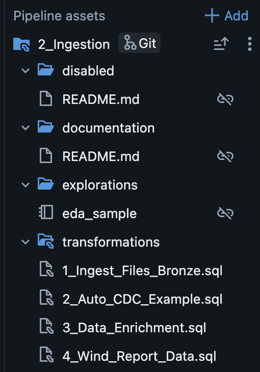
1. The transformations folder contains all of the source code that will be run in a declarative fashion by the pipeline. The disabled folder is an excluded folder that is a handy place to store in-develpment pipeline objects.
1. Open `1_Ingest_Files_Bronze.sql`. In section 2 step 2 earlier we made note of our unique user ID (e.g., `AD_82257556`). You'll need to to a 'find/replace' function (either option+F or cmd+f depending on your system). Search and replace all instances of `{YOUR_UNIQUE_DB}` and replace all instances with you unique user ID (e.g., `AD_82257556`)<br/><br/>
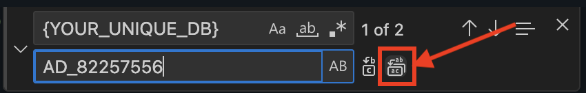
1. Repeat step 8 for the remaining files:
    * 2_Auto_CDC_Example.sql
    * 3_Data_Enrichment.sql
    * 4_Wind_Report_Data.sql 

## Terminology and conventions used
* "AESO" refers to Alberta Electric System Operator. This is the entity that tracks energy resources in Alberta. They are just an org that helps out by providing data to consumers. This is who we got the data from for this project.
* "MW" refers to megawatts, a unit of power that the AESO uses for market operations, managing electricity demand, and planning the transmission system.
* "OPT" refers to the optimal forecast.
* "MAX" refers to the forecasted maximum value.
* "MIN" refers to the forecasted minimum.
* "ACTUAL" refers to the observed value.
* "MCR" refers to the Maximum Continuous Rating in the context of the AESO (Alberta Electric System Operator), which is the maximum net power output an import source asset can sustain. The AESO uses MCR, or maximum capability, to understand the available power from assets and operate Alberta's power grid safely and reliably
